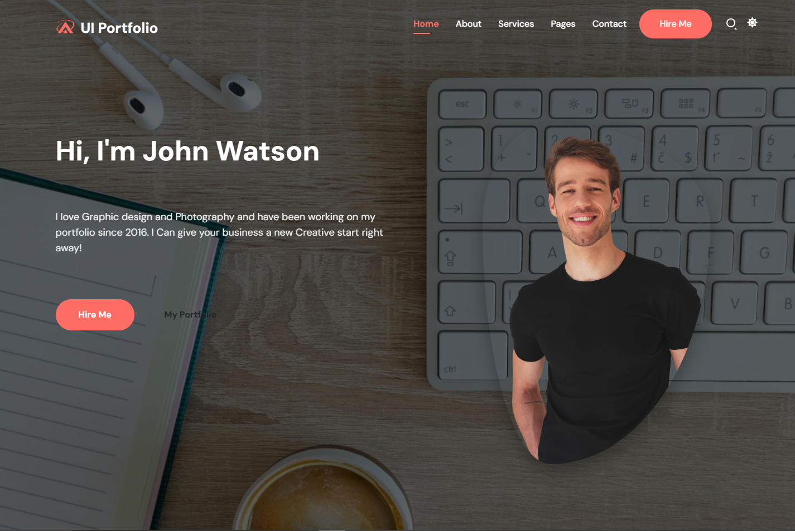

# UI Portfolio Website

A responsive personal portfolio website built with HTML, CSS, JavaScript, and Bootstrap.



## Live Demo

[View Live Demo](https://NMsby.github.io/ui-portfolio/)

## Description

UI Portfolio is a modern, responsive portfolio website template designed for UI/UX designers, web developers, and creative professionals to showcase their work and skills. The website features a clean, professional design with interactive elements and smooth animations.

## Features

- **Responsive Design**: Fully responsive layout that works seamlessly across all devices
- **Interactive UI**: Engaging user interface with hover effects and smooth animations
- **Multiple Sections**: Dedicated sections for about, services, skills, portfolio, and contact information
- **Dynamic Content**: Typing animation effect on the hero section
- **Animated Progress Bars**: Visual representation of skills with animated progress bars
- **Portfolio Gallery**: Showcase your work with a filterable portfolio gallery and lightbox
- **Testimonials**: Display client testimonials in a carousel layout
- **Contact Form**: Easy-to-use contact form for potential clients to reach out
- **Dark/Light Mode**: Theme toggle for user preference
- **Smooth Scrolling**: Enhanced user experience with smooth scrolling navigation

## Technologies Used

- **HTML5**: Semantic markup structure
- **CSS3**: Modern styling with flexbox and grid layouts
- **JavaScript**: Interactive elements and animations
- **Bootstrap 5**: Responsive grid system and components
- **Font Awesome**: Icon library for various UI elements
- **Google Fonts**: Typography enhancements
- **Owl Carousel**: Smooth testimonial and client logo carousels

## Setup Instructions

1. **Clone the repository**
   ```
   git clone https://github.com/your-username/ui-portfolio.git
   ```

2. **Navigate to the project directory**
   ```
   cd ui-portfolio
   ```

3. **Open the website**
    - Double-click on `index.html` or open it with your preferred browser
    - Alternatively, you can use a local development server:
      ```
      # Using Python
      python -m http.server
      
      # Using Node.js (after installing http-server)
      npx http-server
      ```

## Customization Guide

### Changing Personal Information

1. Open `index.html` and modify the following sections:
    - Hero section: Update name, profession, and introduction
    - About section: Update biography and personal details
    - Skills section: Adjust skill names and progress bar percentages
    - Portfolio section: Add your own projects and descriptions

### Updating Images

1. Replace the following images in the `assets/images` directory:
    - `banner.png`: Profile image in the hero section
    - `about.jpg`: About section image
    - `blog1.jpg` through `blog6.jpg`: Portfolio project images
    - `logo1.png` through `logo5.png`: Client logos

### Changing Colors

1. Open `assets/css/style.css` and modify the CSS variables in the `:root` selector:
   ```css
   :root {
     --primary-color: #ff6e65;
     --secondary-color: #3f3a64;
     /* Other color variables */
   }
   ```

## Acknowledgements

- Original design inspiration from [W3Layouts](https://w3layouts.com/)
- Images from [Unsplash](https://unsplash.com/)
- Icons from [Font Awesome](https://fontawesome.com/)
- Fonts from [Google Fonts](https://fonts.google.com/)

## License

This project is under MIT License and is created for educational purposes as part of my web development journey - see the [LICENSE](LICENSE) for details.